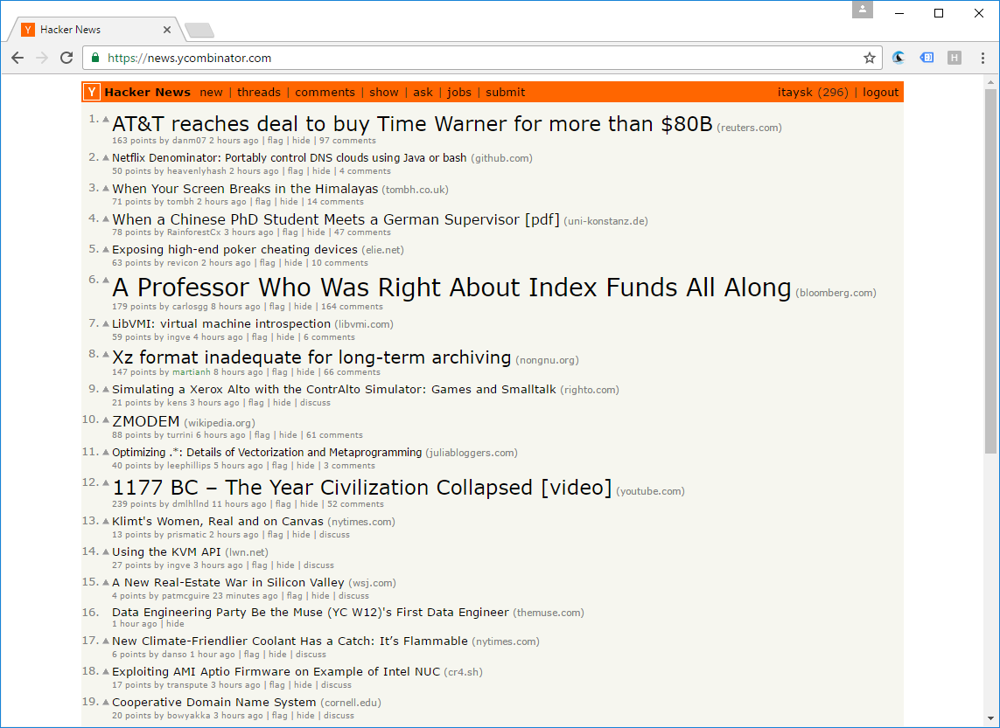

Chrome extension to visually emphasize stories on HN by changing font size according to the number of points (upvotes) and comments.

The extension is available on the [Chrome Web Store](https://chrome.google.com/webstore/detail/hacker-news-visual-rank/hnbdiaedemlcfnjpdgadhhhdmmhhlncm) and the [Firefox Addons](https://addons.mozilla.org/en-US/firefox/addon/hacker-news-visual-rank/).

It is very easily converable to Apple Safary extension using the [safari-web-extension-converter](https://bartsolutions.github.io/2020/11/20/safari-extension/) tool. The generated Safari extention can be side-loaded locally. The only reason I've not published it to the App Store is Apple's expensive developer fee.

